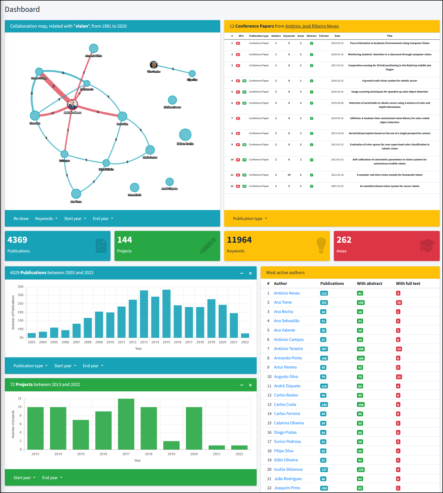

# Knowledge Maps as support tool for managing scientific competences

- [Master's thesis](https://ria.ua.pt/bitstream/10773/38423/1/Documento_Joao_Genio.pdf)
- [Thesis defence presentation](https://docs.google.com/presentation/d/1MJslC3x_UZSyaVDdEgvXpSZNwnNSty6E/edit?usp=sharing&ouid=107393300356632046436&rtpof=true&sd=true)
- [Scientific article](https://doi.org/10.3390/publications11010019)

## Main features

- Fetch academic data like publications, conference papers and projects from Scopus and Ciência Vitae APIs.
- Automatic conflict resolution between the two sources.
- Visualize in-house competences through interactive knowledge maps and graphs.
- Ability to filter data by author, year, type of publication, etc.

Example of one of the main views of the application:



# Getting Started

## Setup

1. (Optional) Create a virtual environment.

```
https://docs.python.org/3/library/venv.html
or
https://virtualenvwrapper.readthedocs.io/en/latest/
```

2. Install requirements.

```sh
cd .../knowledge-maps/
pip3 install -r requirements.txt
```

3. Rename the following files:
```
.../knowledge-maps/mkm/knowledge/api_utils/config.json.old
.../knowledge-maps/mkm/knowledge/api_utils/config.ini.old
```
to
```
config.json
config.ini
```

4. Add API keys to the following files:
```
.../knowledge-maps/mkm/knowledge/api_utils/config.json
.../knowledge-maps/mkm/knowledge/api_utils/config.ini
```

**(IMPORTANT)** Scopus API synchronization only works when executing the program from within an authorized organization (e.g. University), or through a VPN. Get your API key [here](https://dev.elsevier.com/).

Contact the [Ciência Vitae](https://www.cienciavitae.pt/servicos/) team for an API key.

5. Apply Django's models to the database.

```sh
cd .../knowledge-maps/mkm
python3 manage.py makemigrations
python3 manage.py migrate
```

6. Create a super user.

```sh
cd .../knowledge-maps/mkm
python3 manage.py createsuperuser
```

## Usage

Run server.

```sh
cd .../knowledge-maps/mkm/
python3 manage.py runserver
```
